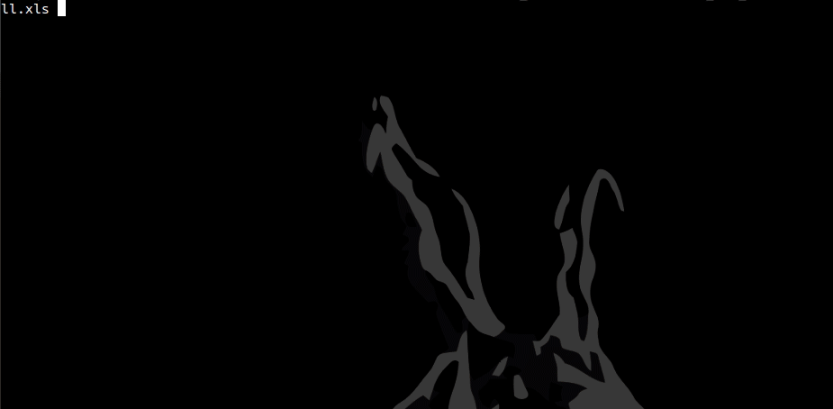

TAFOF Unpacker
==============

TA505 Unpacker is a python 2.7 script that is able to unpack statically, x86 and x64 TA505 packed samples.

Currently malware spotted to be packed with that packer:
- GetandGoDll
- Silence (https://twitter.com/Vishnyak0v/status/1199620846823890944)
- TinyMet (https://twitter.com/darb0ng/status/1202823405747073024)
- Azorult (https://twitter.com/Vishnyak0v/status/1204312402306752513)
- KBMiner (https://www.botconf.eu/wp-content/uploads/2019/12/B2019-Eremin_Bot_with_rootkit.pdf)
- ...

### Usage
```
$ python ta505_unpacker.py -h
▄▄▄█████▓▄▄▄       █████▒█████   █████▒    █    ██ ███▄    █ ██▓███  ▄████▄  ██ ▄█▀██▀███  
▓  ██▒ ▓▒████▄   ▓██   ▒██▒  ██▓██   ▒     ██  ▓██▒██ ▀█   █▓██░  ██▒██▀ ▀█  ██▄█▒▓██ ▒ ██▒
▒ ▓██░ ▒▒██  ▀█▄ ▒████ ▒██░  ██▒████ ░    ▓██  ▒██▓██  ▀█ ██▓██░ ██▓▒▓█    ▄▓███▄░▓██ ░▄█ ▒
░ ▓██▓ ░░██▄▄▄▄██░▓█▒  ▒██   ██░▓█▒  ░    ▓▓█  ░██▓██▒  ▐▌██▒██▄█▓▒ ▒▓▓▄ ▄██▓██ █▄▒██▀▀█▄  
  ▒██▒ ░ ▓█   ▓██░▒█░  ░ ████▓▒░▒█░       ▒▒█████▓▒██░   ▓██▒██▒ ░  ▒ ▓███▀ ▒██▒ █░██▓ ▒██▒
  ▒ ░░   ▒▒   ▓▒█░▒ ░  ░ ▒░▒░▒░ ▒ ░       ░▒▓▒ ▒ ▒░ ▒░   ▒ ▒▒▓▒░ ░  ░ ░▒ ▒  ▒ ▒▒ ▓░ ▒▓ ░▒▓░
    ░     ▒   ▒▒ ░░      ░ ▒ ▒░ ░         ░░▒░ ░ ░░ ░░   ░ ▒░▒ ░      ░  ▒  ░ ░▒ ▒░ ░▒ ░ ▒░
  ░       ░   ▒   ░ ░  ░ ░ ░ ▒  ░ ░        ░░░ ░ ░   ░   ░ ░░░      ░       ░ ░░ ░  ░░   ░ 
              ░  ░         ░ ░               ░             ░        ░ ░     ░  ░     ░     
                                                                    ░                      
|-->TA505 Unpacker.
usage: ta505_unpacker.py [-h] [-f FILE] [-x] [-u]

TA505 Unpacker.

optional arguments:
  -h, --help            show this help message and exit
  -f FILE, --file FILE  File to decrypt.
  -x, --xls             Extract bin from XLS, default to False.
  -u, --upx             UPX decryption to final payload, default to False.
```

#### Example 1.1: GetandGoDLL from XLS file.
```
$ python ta505_unpacker.py -uxf tafof_xls_getandgodll.xls 
▄▄▄█████▓▄▄▄       █████▒█████   █████▒    █    ██ ███▄    █ ██▓███  ▄████▄  ██ ▄█▀██▀███  
▓  ██▒ ▓▒████▄   ▓██   ▒██▒  ██▓██   ▒     ██  ▓██▒██ ▀█   █▓██░  ██▒██▀ ▀█  ██▄█▒▓██ ▒ ██▒
▒ ▓██░ ▒▒██  ▀█▄ ▒████ ▒██░  ██▒████ ░    ▓██  ▒██▓██  ▀█ ██▓██░ ██▓▒▓█    ▄▓███▄░▓██ ░▄█ ▒
░ ▓██▓ ░░██▄▄▄▄██░▓█▒  ▒██   ██░▓█▒  ░    ▓▓█  ░██▓██▒  ▐▌██▒██▄█▓▒ ▒▓▓▄ ▄██▓██ █▄▒██▀▀█▄  
  ▒██▒ ░ ▓█   ▓██░▒█░  ░ ████▓▒░▒█░       ▒▒█████▓▒██░   ▓██▒██▒ ░  ▒ ▓███▀ ▒██▒ █░██▓ ▒██▒
  ▒ ░░   ▒▒   ▓▒█░▒ ░  ░ ▒░▒░▒░ ▒ ░       ░▒▓▒ ▒ ▒░ ▒░   ▒ ▒▒▓▒░ ░  ░ ░▒ ▒  ▒ ▒▒ ▓░ ▒▓ ░▒▓░
    ░     ▒   ▒▒ ░░      ░ ▒ ▒░ ░         ░░▒░ ░ ░░ ░░   ░ ▒░▒ ░      ░  ▒  ░ ░▒ ▒░ ░▒ ░ ▒░
  ░       ░   ▒   ░ ░  ░ ░ ░ ▒  ░ ░        ░░░ ░ ░   ░   ░ ░░░      ░       ░ ░░ ░  ░░   ░ 
              ░  ░         ░ ░               ░             ░        ░ ░     ░  ░     ░     
                                                                    ░                      
|-->TA505 Unpacker.
|--> Extracting binaries from XLS.
|--> Extracted TA505 binary from XLS: TA505_XLS_bin_x86_tafof_xls_getandgodll.xls.bin
|--> Extracted TA505 binary from XLS: TA505_XLS_bin_x64_tafof_xls_getandgodll.xls.bin
|--> Starting TA505 Unpacker
|--> Loaded Packed Exe Data: TA505_XLS_bin_x86_tafof_xls_getandgodll.xls.bin
|--> Encrypted Layer One size: 0X3C960
|--> Found Encrypted Code
|--> Found XOR KEY: 0X79AA
|--> Layer One encryption: rol_4
|--> Decrypted TA505 First Layer
|--> Unpacked TA505: TA505_unpacker_TA505_XLS_bin_x86_tafof_xls_getandgodll.xls.bin
|--> Unpacked TA505 UPX: TA505_UPX_unpacker_TA505_XLS_bin_x86_tafof_xls_getandgodll.xls.bin
|--> Unpacked Successfully
```



#### Example 1.2: GetandGoDLL from XLS file (updated version x86/x64).

```
$ python ta505_unpacker.py -uxf tafof_xls_getandgodll.xls
▄▄▄█████▓▄▄▄       █████▒█████   █████▒    █    ██ ███▄    █ ██▓███  ▄████▄  ██ ▄█▀██▀███
▓  ██▒ ▓▒████▄   ▓██   ▒██▒  ██▓██   ▒     ██  ▓██▒██ ▀█   █▓██░  ██▒██▀ ▀█  ██▄█▒▓██ ▒ ██▒
▒ ▓██░ ▒▒██  ▀█▄ ▒████ ▒██░  ██▒████ ░    ▓██  ▒██▓██  ▀█ ██▓██░ ██▓▒▓█    ▄▓███▄░▓██ ░▄█ ▒
░ ▓██▓ ░░██▄▄▄▄██░▓█▒  ▒██   ██░▓█▒  ░    ▓▓█  ░██▓██▒  ▐▌██▒██▄█▓▒ ▒▓▓▄ ▄██▓██ █▄▒██▀▀█▄
  ▒██▒ ░ ▓█   ▓██░▒█░  ░ ████▓▒░▒█░       ▒▒█████▓▒██░   ▓██▒██▒ ░  ▒ ▓███▀ ▒██▒ █░██▓ ▒██▒
  ▒ ░░   ▒▒   ▓▒█░▒ ░  ░ ▒░▒░▒░ ▒ ░       ░▒▓▒ ▒ ▒░ ▒░   ▒ ▒▒▓▒░ ░  ░ ░▒ ▒  ▒ ▒▒ ▓░ ▒▓ ░▒▓░
    ░     ▒   ▒▒ ░░      ░ ▒ ▒░ ░         ░░▒░ ░ ░░ ░░   ░ ▒░▒ ░      ░  ▒  ░ ░▒ ▒░ ░▒ ░ ▒░
  ░       ░   ▒   ░ ░  ░ ░ ░ ▒  ░ ░        ░░░ ░ ░   ░   ░ ░░░      ░       ░ ░░ ░  ░░   ░
              ░  ░         ░ ░               ░             ░        ░ ░     ░  ░     ░
                                                                    ░
|--> TA505 Unpacker.
|--> Extracting binaries from XLS.
|--> Extracted TA505 binary from XLS: TAFOF_XLS_bin_x86_1_tafof_xls_getandgodll.xls.bin
|--> Extracted TA505 binary from XLS: TAFOF_XLS_bin_x64_2_tafof_xls_getandgodll.xls.bin
|--> Starting TA505 x86 Unpacker
|--> Loaded Packed Exe Data: TAFOF_XLS_bin_x86_1_tafof_xls_getandgodll.xls.bin
|--> Encrypted Layer One size: 0X3C960
|--> Found Encrypted Code
|--> Found XOR KEY: 0X79AA
|--> Layer One encryption: rol_4
|--> Decrypted TA505 First Layer
|--> Unpacked TA505 x86: TAFOF_unpacker_TAFOF_XLS_bin_x86_1_tafof_xls_getandgodll.xls.bin
|--> Unpacked TA505 UPX Layer 2: TAFOF_UPX2_unpacker_TAFOF_XLS_bin_x86_1_tafof_xls_getandgodll.xls.bin
|--> Unpacked x86 Successfully
|--> Starting TA505 x64 Unpacker
|--> Unpacked TA505 UPX Layer 1: TAFOF_UPX1_unpacker_TAFOF_XLS_bin_x64_2_tafof_xls_getandgodll.xls.bin
|--> Loaded Packed Exe Data: TAFOF_UPX1_unpacker_TAFOF_XLS_bin_x64_2_tafof_xls_getandgodll.xls.bin
|--> Encrypted Layer One size: 0X34FB0
|--> Found Encrypted Code
|--> Found XOR KEY: 0X7D74
|--> Layer One encryption: rol_7
|--> Decrypted TA505 First Layer
|--> Unpacked TA505 x64: TAFOF_unpacker_TAFOF_UPX1_unpacker_TAFOF_XLS_bin_x64_2_tafof_xls_getandgodll.xls.bin
|--> Unpacked x64 Successfully
```

#### Example 2: Silence.
```
$ python ta505_unpacker.py -uf tafof_silence.bin 
▄▄▄█████▓▄▄▄       █████▒█████   █████▒    █    ██ ███▄    █ ██▓███  ▄████▄  ██ ▄█▀██▀███  
▓  ██▒ ▓▒████▄   ▓██   ▒██▒  ██▓██   ▒     ██  ▓██▒██ ▀█   █▓██░  ██▒██▀ ▀█  ██▄█▒▓██ ▒ ██▒
▒ ▓██░ ▒▒██  ▀█▄ ▒████ ▒██░  ██▒████ ░    ▓██  ▒██▓██  ▀█ ██▓██░ ██▓▒▓█    ▄▓███▄░▓██ ░▄█ ▒
░ ▓██▓ ░░██▄▄▄▄██░▓█▒  ▒██   ██░▓█▒  ░    ▓▓█  ░██▓██▒  ▐▌██▒██▄█▓▒ ▒▓▓▄ ▄██▓██ █▄▒██▀▀█▄  
  ▒██▒ ░ ▓█   ▓██░▒█░  ░ ████▓▒░▒█░       ▒▒█████▓▒██░   ▓██▒██▒ ░  ▒ ▓███▀ ▒██▒ █░██▓ ▒██▒
  ▒ ░░   ▒▒   ▓▒█░▒ ░  ░ ▒░▒░▒░ ▒ ░       ░▒▓▒ ▒ ▒░ ▒░   ▒ ▒▒▓▒░ ░  ░ ░▒ ▒  ▒ ▒▒ ▓░ ▒▓ ░▒▓░
    ░     ▒   ▒▒ ░░      ░ ▒ ▒░ ░         ░░▒░ ░ ░░ ░░   ░ ▒░▒ ░      ░  ▒  ░ ░▒ ▒░ ░▒ ░ ▒░
  ░       ░   ▒   ░ ░  ░ ░ ░ ▒  ░ ░        ░░░ ░ ░   ░   ░ ░░░      ░       ░ ░░ ░  ░░   ░ 
              ░  ░         ░ ░               ░             ░        ░ ░     ░  ░     ░     
                                                                    ░                      
|-->TA505 Unpacker.
|--> Starting TA505 Unpacker
|--> Loaded Packed Exe Data: tafof_silence.bin
|--> Encrypted Layer One size: 0X23280
|--> Found Encrypted Code
|--> Found XOR KEY: 0X5EFE
|--> Layer One encryption: rol_7
|--> Decrypted TA505 First Layer
|--> Unpacked TA505: TA505_unpacker_tafof_silence.bin
|--> Unpacked Successfully
```


#### Requirements
- yara-python (latest tested version "4.0.1")
- pefile (latest tested version "2019.4.18")
- UPX


### Support

In case some files are not working, please make sure its packed with TA505 packer, if yes please provide me the hash in a DM @Tera0017.

Regards


